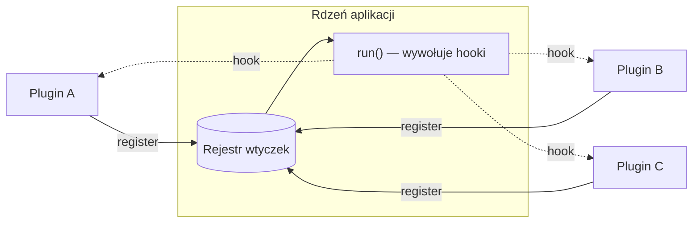

# Plugin Pattern

> PL: Wtyczka / Rozszerzenie

## Preview 🎉

- PL: <https://github.com/piecioshka/poj-lab-1> (Java)

## Description

**Plugin** to wzorzec, w którym _rdzeń_ aplikacji (host) udostępnia stabilny
punkt rozszerzeń, a niezależne moduły (wtyczki) dokładają nową funkcjonalność
bez modyfikowania rdzenia. Host nie zna wtyczek z góry — odkrywa je przez
**rejestrację** w czasie działania.

To praktyczne uosobienie
[Open-Closed Principle](chapters/patterns/solid/open-closed-principle.md):
rdzeń jest _zamknięty na modyfikację_, ale _otwarty na rozszerzenie_ przez
wtyczki. Znasz to z `eslint`, `webpack`, `rollup`, `vite`, edytorów (VS Code)
czy jQuery (`$.fn.myPlugin`).

- Use Cases (kiedy stosować)
  - Chcesz, by strony trzecie (lub inne zespoły) dokładały funkcje bez ruszania
    Twojego kodu.
  - Funkcje są opcjonalne / ładowane warunkowo (np. tylko gdy potrzebne).
  - Budujesz ekosystem wokół rdzenia (narzędzia, edytory, frameworki).
- Pros
  - Rdzeń mały i stabilny; rozszerzenia odseparowane.
  - [Open-Closed Principle](chapters/patterns/solid/open-closed-principle.md)
    oraz [Inversion of Control](chapters/patterns/misc/inversion-of-control.md)
    — to rdzeń woła wtyczkę, nie odwrotnie.
  - Wtyczki można włączać/wyłączać i wersjonować niezależnie.
- Cons
  - Potrzebny stabilny kontrakt (API) — jego zmiana łamie wszystkie wtyczki.
  - Trudniejsze debugowanie (luźno powiązany przepływ sterowania).
  - Ryzyko: niezaufana wtyczka działa z uprawnieniami hosta.

## Diagram



Wtyczki rejestrują się w rdzeniu, a rdzeń w odpowiednim momencie woła ich
„haki" (hooki). Sterowanie jest odwrócone — stąd związek z
[Inversion of Control](chapters/patterns/misc/inversion-of-control.md).

## Example

Minimalny host z punktem rozszerzeń `transform` oraz dwie wtyczki:

```js
// --- rdzeń (host) ---
class Editor {
  constructor() {
    this._plugins = [];
  }

  // punkt rozszerzeń: wtyczka rejestruje się sama
  use(plugin) {
    this._plugins.push(plugin);
    return this; // fluent API
  }

  // rdzeń woła hooki wtyczek — Inversion of Control
  format(text) {
    return this._plugins.reduce((acc, plugin) => plugin.transform(acc), text);
  }
}

// --- wtyczki (niezależne od siebie i od wnętrza rdzenia) ---
const uppercasePlugin = { transform: (text) => text.toUpperCase() };
const exclaimPlugin = { transform: (text) => `${text}!` };

// --- użycie ---
const editor = new Editor().use(uppercasePlugin).use(exclaimPlugin);
editor.format("hello"); // "HELLO!"

// nowa funkcja = nowa wtyczka, zero zmian w klasie Editor:
const trimPlugin = { transform: (text) => text.trim() };
new Editor().use(trimPlugin).use(uppercasePlugin).format("  hi "); // "HI"
```

> 💡 Kontrakt wtyczki (tu: obiekt z metodą `transform`) to serce wzorca.
> Dopóki jest stabilny, rdzeń i wtyczki mogą ewoluować niezależnie.

## Resources

- <https://github.com/jquery-boilerplate/jquery-patterns/wiki/jQuery-Plugin-Patterns-Guide>
- <https://en.wikipedia.org/wiki/Plug-in_(computing)>
