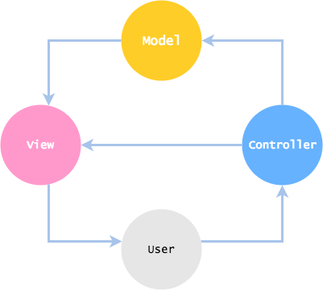

# Software Design Patterns / Architectural / MVC

## Demo 🎉

<a href="./demo/mvc/">demo/mvc</a>

## Description

* <https://en.wikipedia.org/wiki/Model%E2%80%93view%E2%80%93controller>

Legend:

* Model - The model is the part of the application that handles the logic for the application data.
* View - The View is the parts of the application that handle the display of the data.
* Controller - The Controller is the part of the application that handles user interaction.

Legend (2):

* A model stores data that is retrieved according to commands from the controller and displayed in the view.
* A view generates an output presentation to the user based on changes in the model.
* A controller can send commands to the model to update the model's state (e.g. editing a document). It can also send commands to its associated view to change the view's presentation of the model (e.g. by scrolling through a document).
