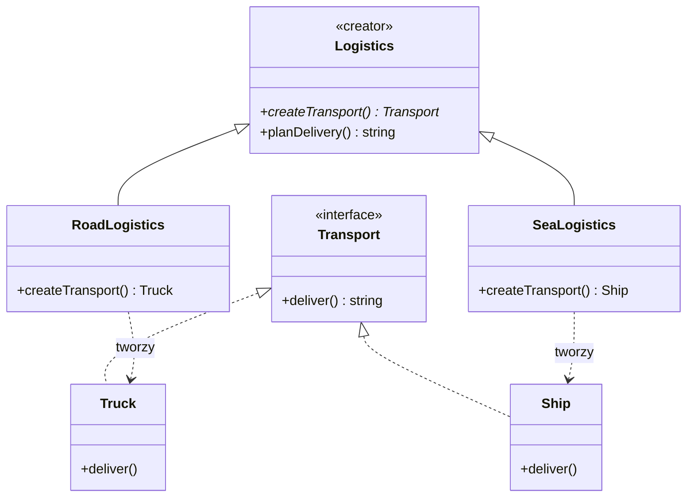

# Software Design Patterns / Creational / Factory Method

> PL: Metoda wytwórcza


## Preview 🎉

- <a href="./demo/factory-method/">demo/factory-method</a>

## Description

**Factory Method** to **wzorzec GoF**, który definiuje w klasie-twórcy (_creator_)
metodę do tworzenia produktu, ale pozostawia **podklasom decyzję, jaką konkretną
klasę produktu utworzyć**. Klasa bazowa zawiera logikę biznesową operującą na
produkcie przez wspólny interfejs — a o tym, _który_ produkt powstanie,
rozstrzyga nadpisana metoda fabryczna w podklasie.

Kluczowy mechanizm to **dziedziczenie i polimorfizm**: to odróżnia go od
[Simple Factory](chapters/patterns/sdp/sdpc/factory.md), gdzie wybór produktu
robi jedna funkcja (najczęściej przez `if`/`switch`), bez podklas.

> ⚠️ **Rozróżnienie:** zob.
> [Simple Factory](chapters/patterns/sdp/sdpc/factory.md) (idiom, jedna funkcja)
> oraz [Abstract Factory](chapters/patterns/sdp/sdpc/abstract-factory.md)
> (rodziny produktów).

- Subjects
  - **creator** — klasa z metodą fabryczną, np. `Logistics`
  - **product** — wspólny interfejs produktu, np. `Transport` (`Truck`, `Ship`)
- Use Cases (kiedy stosować)
  - Tworzysz bibliotekę/framework i chcesz, by użytkownik **nadpisał** sposób
    tworzenia obiektów wewnętrznych.
  - Klasa nie wie z góry, jakie obiekty produktów ma tworzyć — zależy to od
    podklasy.
  - Podstawianie atrap (mocków) w testach przez nadpisanie metody fabrycznej.
- Pros
  - Ta sama metoda nadpisana w wielu podklasach → z zewnątrz nic się nie zmienia
    ([Open-Closed Principle](chapters/patterns/solid/open-closed-principle.md)).
  - Oddziela kod tworzenia produktu od kodu, który go używa.
- Cons
  - Więcej klas i hierarchia dziedziczenia → bardziej złożony kod.
  - Dla prostego „wybierz typ po stringu" wystarczy
    [Simple Factory](chapters/patterns/sdp/sdpc/factory.md).

## Diagram



`Logistics.planDelivery()` korzysta z produktu, ale **nie wie**, czy to `Truck`,
czy `Ship` — decyduje o tym podklasa przez nadpisaną `createTransport()`.

## Example

### Problem — wybór produktu zaszyty w logice

Logika biznesowa sama tworzy konkretne klasy. Dodanie nowego transportu wymusza
edycję `planDelivery` — to łamie
[Open-Closed Principle](chapters/patterns/solid/open-closed-principle.md).

```js
class Logistics {
  planDelivery(type) {
    let transport;
    if (type === "road") {
      transport = new Truck();
    } else if (type === "sea") {
      transport = new Ship(); // nowy transport = edycja tej metody
    }
    return transport.deliver();
  }
}
```

### Solution — metodę fabryczną nadpisują podklasy

```js
// Creator: definiuje metodę fabryczną i logikę biznesową na produkcie
class Logistics {
  // metoda fabryczna — podklasa MUSI ją nadpisać
  createTransport() {
    throw new Error("createTransport() must be implemented by a subclass");
  }

  // logika biznesowa nie wie, jaki konkretny produkt dostaje
  planDelivery() {
    const transport = this.createTransport();
    return transport.deliver();
  }
}

// Konkretni twórcy decydują o klasie produktu
class RoadLogistics extends Logistics {
  createTransport() {
    return new Truck();
  }
}

class SeaLogistics extends Logistics {
  createTransport() {
    return new Ship();
  }
}

// Produkty ze wspólnym interfejsem
class Truck {
  deliver() {
    return "deliver by road in a box";
  }
}

class Ship {
  deliver() {
    return "deliver by sea in a container";
  }
}

// --- użycie ---
new RoadLogistics().planDelivery(); // "deliver by road in a box"
new SeaLogistics().planDelivery(); // "deliver by sea in a container"

// nowy transport = nowa podklasa, ZERO zmian w Logistics.planDelivery():
class AirLogistics extends Logistics {
  createTransport() {
    return { deliver: () => "deliver by air" };
  }
}
new AirLogistics().planDelivery(); // "deliver by air"
```

## Resources

- 🚀 <https://refactoring.guru/design-patterns/factory-method>
- <https://www.dofactory.com/javascript/factory-method-design-pattern>
- <https://medium.com/javascript-scene/javascript-factory-functions-vs-constructor-functions-vs-classes-2f22ceddf33e>
- <https://addyosmani.com/resources/essentialjsdesignpatterns/book/#factorypatternjavascript>
- PL: <http://www.algorytm.org/wzorce-projektowe/metoda-wytworcza-factory-method.html>
- PL: <https://lukasz-socha.pl/php/wzorce-projektowe-cz-7-factory-method/> (PHP)
