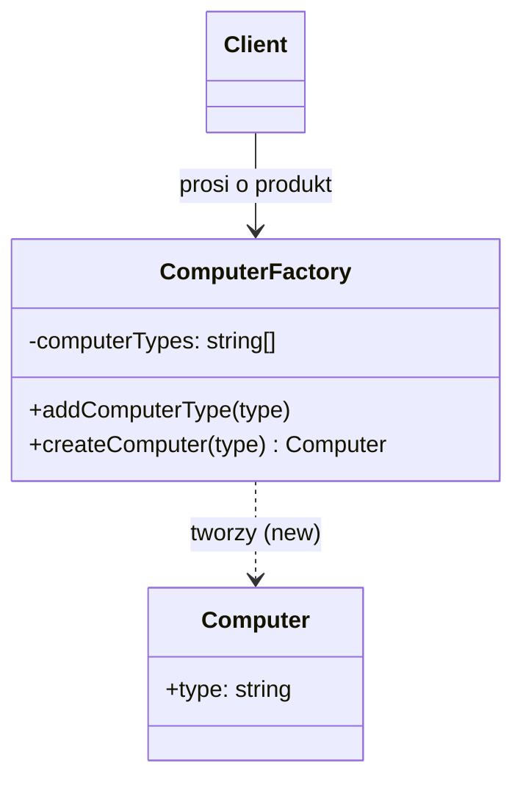

# Software Design Patterns / Creational / Simple Factory (Factory Function)

> PL: Fabryka prosta


## Preview 🎉

- <a href="./demo/factory-method/">demo/factory-method</a>

## Description

**Simple Factory** (zwana też _Factory Function_) to **idiom**, a nie formalny
wzorzec z katalogu „Gang of Four". Jego sednem jest jedna funkcja/metoda, która
centralizuje tworzenie obiektów: zamiast wołać `new ConcreteClass()` w wielu
miejscach, klient prosi o obiekt jedną metodą fabryczną i dostaje gotowy
egzemplarz — nie wiedząc, która konkretnie klasa stoi za daną „etykietą".

Dzięki temu logika decydująca „co i jak utworzyć" mieszka w jednym miejscu.
Gdy pojawia się nowy typ produktu, zmieniasz wyłącznie fabrykę — kod kliencki
zostaje nietknięty.

> ⚠️ **Nie myl z** [Factory Method](chapters/patterns/sdp/sdpc/factory-method.md)
> ani [Abstract Factory](chapters/patterns/sdp/sdpc/abstract-factory.md) —
> patrz tabela poniżej.

### Simple Factory vs Factory Method vs Abstract Factory

| Nazwa | Wzorzec GoF? | Sedno |
|---|---|---|
| **Simple Factory** (ta strona) | ❌ idiom | Jedna funkcja/metoda centralizuje `new` (np. `createComputer(type)`). |
| [Factory Method](chapters/patterns/sdp/sdpc/factory-method.md) | ✅ tak | Klasa-twórca ma metodę, którą **podklasy nadpisują**, by zdecydować, jaki produkt powstanie. |
| [Abstract Factory](chapters/patterns/sdp/sdpc/abstract-factory.md) | ✅ tak | Tworzy **całe rodziny** powiązanych obiektów. |

- Use Cases (kiedy stosować)
  - Tworzenie obiektów zależy od konfiguracji / danych wejściowych
    (np. typ przekazany jako string, format pliku, środowisko).
  - Chcesz scentralizować i walidować proces powstawania obiektów.
  - Chcesz móc dodawać nowe typy bez modyfikacji kodu klienta
    ([Open-Closed Principle](chapters/patterns/solid/open-closed-principle.md)).
- Pros
  - Centralne miejsce tworzenia → łatwiejsze utrzymanie i walidacja.
  - Klient zależy od _interfejsu_, a nie od konkretnych klas (luźne sprzężenie).
  - Wspiera [Open-Closed Principle](chapters/patterns/solid/open-closed-principle.md).
- Cons
  - Dodatkowa warstwa abstrakcji = więcej kodu przy prostych przypadkach.
  - Nadużywana bywa „fabryką do wszystkiego", która łamie
    [Single Responsibility Principle](chapters/patterns/solid/single-responsibility-principle.md).
  - To tylko idiom — gdy potrzebujesz polimorficznego rozszerzania przez
    podklasy, sięgnij po [Factory Method](chapters/patterns/sdp/sdpc/factory-method.md).

## Diagram



Klient zna tylko fabrykę i jej metodę `createComputer(type)`. To fabryka
decyduje, jaki obiekt powstanie — i czy w ogóle powstanie. Zwróć uwagę: tu nie
ma dziedziczenia — to właśnie odróżnia Simple Factory od
[Factory Method](chapters/patterns/sdp/sdpc/factory-method.md).

## Example

### Problem — `new` rozsiane po kodzie

Bez fabryki każdy klient sam decyduje, co i jak stworzyć. Walidacja typu
i wiedza o konstruktorze duplikują się w wielu miejscach.

```js
// klient #1
const c1 = new Computer({ type: "notebook" }); // a co z nieznanym typem?

// klient #2 (inny plik) — ta sama walidacja powtórzona ręcznie
const allowed = ["notebook", "pc"];
const c2 = allowed.includes("macbook") ? new Computer({ type: "macbook" }) : null;
```

### Solution — jedna metoda fabryczna

```js
class ComputerFactory {
  constructor() {
    this._computerTypes = [];
  }

  addComputerType(type) {
    this._computerTypes.push(type);
  }

  createComputer(type) {
    // walidacja w jednym miejscu
    if (!this._computerTypes.includes(type)) {
      return null;
    }
    return new Computer({ type });
  }
}

class Computer {
  constructor(options) {
    this.type = options.type;
  }
}

// --- użycie ---
const cf = new ComputerFactory();
cf.addComputerType("notebook");
cf.addComputerType("pc");

cf.createComputer("notebook"); // Computer { type: "notebook" }
cf.createComputer("macbook"); // null — nieznany typ obsłużony centralnie
```

> 💡 W JavaScript Simple Factory bywa też zwykłą **funkcją**, która zwraca obiekt
> (`const createComputer = (type) => ({ type })`) — nie potrzebujesz klas, aby
> skorzystać z tego idiomu.

## Resources

- 🚀 <https://refactoring.guru/design-patterns/factory-comparison>
- <https://www.dofactory.com/javascript/factory-method-design-pattern>
- <https://medium.com/front-end-weekly/understand-the-factory-design-pattern-in-plain-javascript-20b348c832bd>
- <https://www.tutorialspoint.com/design_pattern/factory_pattern.htm>
