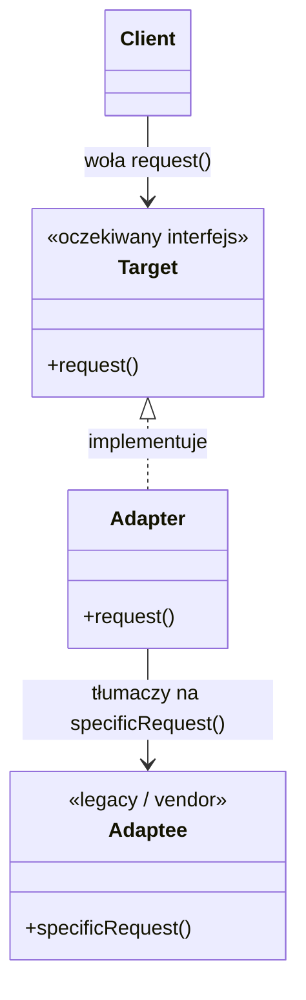

# Software Design Patterns / Structural / Adapter (Wrapper)

> PL: Przejściówka


## Preview 🎉

- <a href="./demo/adapter/">demo/adapter</a>

## Description

**Adapter** (Wrapper) to wzorzec strukturalny, który pozwala współpracować
obiektom o _niekompatybilnych interfejsach_. Adapter „tłumaczy" wywołania
jednego interfejsu na drugi — jak przejściówka między wtyczką a gniazdkiem.

Klient mówi w swoim języku (`request()`), a adapter zamienia to na to, co
naprawdę rozumie obca/legacy klasa (`specificRequest()`). Kod klienta i kod
biblioteki pozostają nietknięte.

- Paradygmaty implementacji
  - **kompozycja/funkcyjnie** — adapter trzyma referencję do obiektu i deleguje
    (działa w każdym języku, preferowane w JS).
  - **dziedziczenie** — adapter rozszerza adaptowaną klasę
    (jak w `demo/adapter`, gdzie `PersonAdapter extends Person`).
- Use Cases (kiedy stosować)
  - Opakowanie zewnętrznej biblioteki we własny, stabilny interfejs.
  - Korzystanie z legacy code, którego nie chcesz/nie możesz zmieniać.
  - Ujednolicenie wielu różnych API pod jeden wspólny interfejs.
- Pros
  - [Single Responsibility Principle](chapters/patterns/solid/single-responsibility-principle.md)
    — konwersja interfejsu odizolowana w jednym miejscu.
  - [Open-Closed Principle](chapters/patterns/solid/open-closed-principle.md)
    — nowe adaptery dodajesz bez ruszania klienta.
  - Pozwala współpracować klasom o niezgodnych interfejsach.
- Cons
  - Dodatkowa warstwa pośrednia (mały narzut, więcej kodu).
  - Przy wielu adapterach rośnie złożoność nawigacji po kodzie.

### Adapter vs Facade

- **Adapter** _dopasowuje_ istniejący interfejs do **konkretnego, oczekiwanego**
  przez klienta — cel: zgodność.
- [Facade](chapters/patterns/sdp/sdps/facade.md) _upraszcza_ — tworzy **nowy,
  wygodniejszy** interfejs do całego podsystemu — cel: wygoda.

## Diagram



## Example

### Problem — niekompatybilny interfejs

Klasa `Person` przyjmuje imię i nazwisko sklejone w jeden string. My chcemy
podawać je osobno — ale nie wolno nam zmieniać `Person` (np. to legacy/vendor).

```js
class Person {
  constructor(name_surname) {
    this.name_surname = name_surname;
  }
  getName() {
    return this.name_surname;
  }
}

const p = new Person("Piotr Kowalski");
p.getName(); // "Piotr Kowalski"

// Jak podać imię i nazwisko niezależnie, nie ruszając Person?
```

### Solution — adapter tłumaczy interfejs

```js
class Person {
  constructor(name_surname) {
    this.name_surname = name_surname;
  }
  getName() {
    return this.name_surname;
  }
}

// Adapter (przez dziedziczenie): nowy interfejs (name, surname)
// tłumaczony na stary (name_surname)
class PersonAdapter extends Person {
  constructor(name, surname) {
    super(`${name} ${surname}`);
  }
}

const pa = new PersonAdapter("Piotr", "Kowalski");
pa.getName(); // "Piotr Kowalski"
```

> 💡 Wariant z **kompozycją** (zamiast `extends`) jest zwykle bezpieczniejszy:
> adapter trzyma `this._person = new Person(...)` i deleguje wywołania — nie
> dziedziczy przypadkiem całego API klasy adaptowanej.

## Resources

- 🚀 <https://refactoring.guru/design-patterns/adapter>
- <https://www.dofactory.com/javascript/adapter-design-pattern>
- <https://en.wikipedia.org/wiki/Adapter_pattern>
- <https://addyosmani.com/resources/essentialjsdesignpatterns/book/#wrapperpatternjquery>
- PL: <https://frontstack.pl/adapter-design-pattern/>
- PL: <https://lukasz-socha.pl/php/wzorce-projektowe-cz-8-adapter/> (PHP)
