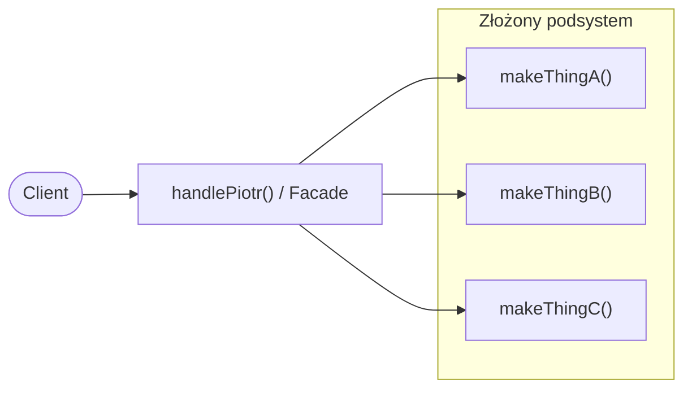

# Software Design Patterns / Structural / Facade

> PL: Fasada


## Preview 🎉

- <a href="./demo/facade/">demo/facade</a>

## Description

**Fasada** to wzorzec strukturalny, który udostępnia _jeden prosty interfejs_
do złożonego podsystemu wielu klas/funkcji. Klient woła jedną metodę zamiast
orkiestrować ręcznie kilka kroków w odpowiedniej kolejności.

Fasada nie ukrywa podsystemu na zawsze — to wygodne „wejście frontowe". Jeśli
ktoś potrzebuje pełnej kontroli, wciąż może sięgnąć do klas pod spodem.

- Use Cases (kiedy stosować)
  - Sekwencja kroków (`makeThingA → makeThingB → makeThingC`) powtarza się
    w wielu miejscach — chcesz ją nazwać i schować za jedną metodą.
  - Chcesz dać klientom tylko te funkcje, na których naprawdę im zależy.
  - Opakowujesz skomplikowaną bibliotekę w prosty, własny interfejs.
- Pros
  - Prosty interfejs do złożonego podsystemu.
  - Mniej duplikacji — kolejność kroków zdefiniowana raz.
  - Odizolowanie klienta od zmian w środku podsystemu.
- Cons
  - Fasada może urosnąć do „boskiego obiektu" sprzężonego ze wszystkim.
  - Dodatkowa warstwa pośrednia.

### Fasada vs Adapter

Oba opakowują coś istniejącego, ale w innym celu:

- **Fasada** _upraszcza_ — tworzy **nowy, wygodniejszy** interfejs do wielu klas.
- [Adapter](chapters/patterns/sdp/sdps/adapter.md) _dopasowuje_ — tłumaczy
  istniejący interfejs na **inny, konkretny, oczekiwany** przez klienta.

## Diagram



## Example

### Problem — klient ręcznie orkiestruje kroki

```js
function makeThingA() {
  console.log("make thing A happen...");
}
function makeThingB(thing) {
  console.log("make thing B happen...", thing);
}
function makeThingC(number) {
  console.log("make thing C happen...", number);
}

const name = "piotr";

// kolejność i argumenty kroków powtórzone w każdej gałęzi
if (name === "piotr") {
  makeThingA();
  makeThingB("kanapka");
  makeThingC(76);
} else if (name === "mateusz") {
  makeThingA();
  makeThingB("tenis");
  makeThingC(55);
}
```

### Solution — fasada nazywa i chowa sekwencję

```js
function makeThingA() {
  console.log("make thing A happen...");
}
function makeThingB(thing) {
  console.log("make thing B happen...", thing);
}
function makeThingC(number) {
  console.log("make thing C happen...", number);
}

// fasady: prosty interfejs ukrywający kolejność kroków
function handlePiotr() {
  makeThingA();
  makeThingB("kanapka");
  makeThingC(76);
}

function handleMateusz() {
  makeThingA();
  makeThingB("tenis");
  makeThingC(55);
}

const name = "piotr";

if (name === "piotr") {
  handlePiotr();
} else if (name === "mateusz") {
  handleMateusz();
}
```

## Resources

- 🚀 <https://refactoring.guru/design-patterns/facade>
- <https://www.dofactory.com/javascript/facade-design-pattern>
- <https://addyosmani.com/resources/essentialjsdesignpatterns/book/#facadepatternjavascript>
- PL: <https://frontstack.pl/facade-design-pattern/>
- PL: <https://lukasz-socha.pl/php/wzorce-projektowe-cz-10-facade/> (PHP)
