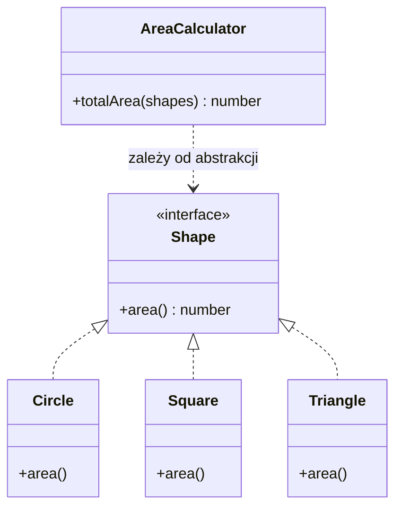

# Open-Closed Principle

> PL: Zasada otwarte-zamknięte

## Preview 🎉

> _„Software entities (classes, modules, functions) should be **open for
> extension**, but **closed for modification**."_ — Bertrand Meyer / Robert C. Martin

## Description

Litera **O** w [SOLID](https://en.wikipedia.org/wiki/SOLID). Moduł powinien być:

- **otwarty na rozszerzenie** — możesz dodać nowe zachowanie,
- **zamknięty na modyfikację** — bez przepisywania istniejącego, przetestowanego
  kodu.

W praktyce: nowy wariant dokładasz, dopisując kod (nową klasę/strategię/wtyczkę),
a nie edytując działające `if/else` czy `switch`. Każda edycja sprawdzonego kodu
to ryzyko regresji w miejscach, które już działały.

Mechanizmem realizującym tę zasadę jest zwykle **polimorfizm** lub
**przekazywanie zachowania jako danych** (mapa, lista handlerów). Wzorce, które
ją wcielają, to m.in.
[Strategy](chapters/patterns/sdp/sdpb/strategy.md),
[Factory](chapters/patterns/sdp/sdpc/factory.md),
[Plugin](chapters/patterns/misc/plugin.md) i
[Decorator](chapters/patterns/sdp/sdps/decorator.md).

- Use Cases (kiedy stosować)
  - Spodziewasz się nowych wariantów tego samego rodzaju (kształty, formaty,
    metody płatności, reguły walidacji).
  - Drabinka `if/else` / `switch` rośnie z każdą nową funkcją.
- Pros
  - Mniej regresji — stary kod zostaje nietknięty.
  - Łatwiejsze testy: nowy wariant testujesz w izolacji.
  - Naturalnie prowadzi do luźnego sprzężenia.
- Cons
  - Wymaga przewidzenia _osi zmienności_ — nadmierna abstrakcja „na zapas"
    łamie [YAGNI](chapters/patterns/misc/you-arent-gonna-need-it.md).

## Diagram



`AreaCalculator` zależy od abstrakcji `Shape`. Nowy kształt = nowa klasa
implementująca `area()` — `AreaCalculator` nie wymaga żadnej zmiany.

## Example

### Problem — każdy nowy kształt zmusza do edycji klasy

```js
class AreaCalculator {
  totalArea(shapes) {
    let total = 0;
    for (const shape of shapes) {
      // dodanie kształtu = MODYFIKACJA tej metody (i ryzyko regresji)
      if (shape.type === "circle") {
        total += Math.PI * shape.radius ** 2;
      } else if (shape.type === "square") {
        total += shape.side ** 2;
      }
      // triangle? znów trzeba tu wejść...
    }
    return total;
  }
}
```

### Solution — polimorfizm zamyka klasę na modyfikację

```js
// każdy kształt sam wie, jak policzyć swoje pole (wspólny "interfejs" area())
class Circle {
  constructor(radius) {
    this.radius = radius;
  }
  area() {
    return Math.PI * this.radius ** 2;
  }
}

class Square {
  constructor(side) {
    this.side = side;
  }
  area() {
    return this.side ** 2;
  }
}

// AreaCalculator jest ZAMKNIĘTY na modyfikację...
class AreaCalculator {
  totalArea(shapes) {
    return shapes.reduce((total, shape) => total + shape.area(), 0);
  }
}

// ...i OTWARTY na rozszerzenie — nowy kształt nie dotyka istniejącego kodu:
class Triangle {
  constructor(base, height) {
    this.base = base;
    this.height = height;
  }
  area() {
    return (this.base * this.height) / 2;
  }
}

new AreaCalculator().totalArea([
  new Circle(2),
  new Square(3),
  new Triangle(4, 5), // po prostu działa
]);
```

## Resources

- <https://en.wikipedia.org/wiki/Open%E2%80%93closed_principle>
- <https://drive.google.com/file/d/0BwhCYaYDn8EgN2M5MTkwM2EtNWFkZC00ZTI3LWFjZTUtNTFhZGZiYmUzODc1/view>
  - January 1996, "Open/Closed Principle" by Robert C. Martin
- <https://blog.cleancoder.com/uncle-bob/2014/05/12/TheOpenClosedPrinciple.html>
